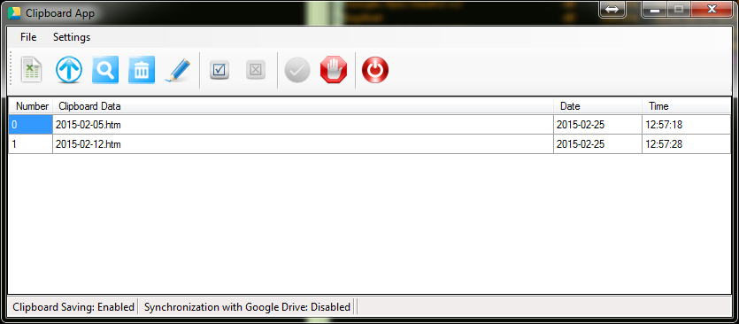

# ClibpboardApp
It's a small portable application written in C# (.NET 4.0 required) used to collect clipboard history.

### Abilities

  - Export collected data to .xls

  - Automatic/manual upload to Google Drive

  - Silent mode
  

### Installation

Copy the contents of the BIN folder to the destination folder and run ClipboardApp.exe. 

If you have not yet installed .NET framework please install it from [www.microsoft.com/net](http://www.microsoft.com/net)
  

### Detailed Description

By default it saves clipboard history to the same directory where ClipboardApp.exe is located. 
A new xls file will be created with 4 columns (Number,Clipboard Data,Date,Time).
Each new item automatically added to this file until midnight.
At this time a new file will be created to prevent files from excessive growing.

The best thing is that you can synchronize these files with your Google Drive too. 
There are 2 ways to sync: manual or automatic. 
By automatic upload every day at a given time your clipboard history is synchronized in the background silently.
 

### License

This software is free for your own personal use without any limitation in time or in features.

This software is "as-is" without any guarantee or warranty.

The author is not responsible/liable for any damage resulting from the use of this software.

Although this software is freeware, other components have their own licenses:

* [DotNetOpenAuth](SRC/ClipboardApp/Google API/DotNetOpenAuth.LICENSE)

* [log4net](SRC/ClipboardApp/Google API/log4net.LICENSE)

* [Newtonsof.Json](SRC/ClipboardApp/Google API/Newtonsof.Json.LICENSE)
